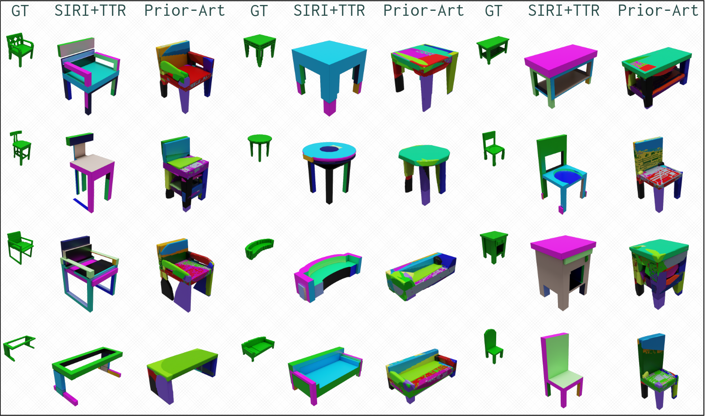

# CoReF: Code Rewriting Families



This repository contains a version of our recent work [Improving Unsupervised Visual Program Inference with Code Rewriting Families](https://bardofcodes.github.io/coref/) presented at ICCV 2023. This repository contains implementation of the different rewriters, and code to train models with PLAD as well as SIRI.

For training models for the VSIC challenge on the 3DCoMPaT dataset, please refer to the `3d_compat.md` markdown file.

## Installation

1. Running the following commands will create a conda environment named `coref` with the necessary packages. The packages and their versions are also listed in `requirements.txt` for alternate installation methods.

```bash
conda create -n "coref" python=3.10.8
conda activate coref
conda install numpy==1.23.5
conda install scipy==1.10.1
conda install conda-forge::h5py==3.8.0
conda install conda-forge::wandb==0.15.7
conda install conda-forge::networkx==3.2
conda install conda-forge::opencv==4.7.0
conda install pytorch==2.1.0 pytorch-cuda=11.8 -c pytorch -c nvidia
conda install -c pytorch -c nvidia faiss-gpu=1.7.2
```

2. Next there are some of my tools which are intergrated into this repository. Running the following commands will install them in a `external` folder.

```bash
mkdir externals
cd externals
# ProcXD
git clone git@github.com:BardOfCodes/procXD.git
cd procXD
python setup.py install --user
cd ..
# Wacky
git clone git@github.com:BardOfCodes/wacky.git
cd wacky
python setup.py install --user
cd ..
# GeoLIPI
git clone git@github.com:BardOfCodes/geolipi.git
cd geolipi
export PYTHONPATH="$PYTHONPATH:$(pwd)"
cd ../..
```

3. Download the required data [here](https://drive.google.com/file/d/10zkO_6uEkhlLKpNsyeoPw7VeEjzkSzb5/view?usp=drive_link) given as a zip file.

```bash
unzip data.zip
```

Additionally, you can download the checkpointed models from the same [folder](https://drive.google.com/drive/folders/1AXa69Cc3m66xd26KOoAv2YUIcyHkJYmL?usp=drive_link).

## Reproducing the results

We can reproduce the results of the paper by following the following steps:

0. Configure the paths: The paths for the data and this repository must be defined in `configs/subconf/machine_spec.py`.

1. Pretrain the model on synthetic data. This will run the pretrain, and the best model will be saved at `project_dir/models/pretrain/best_model.pt`.

```bash
python scripts/train.py --config-file configs/pretrain.py --name pretrain 
```

2. Train SIRI/PLAD with the following script. Let `$model_path` denote the path of the best pretrained model from step 1.

```bash
python scripts/train.py --config-file configs/siri.py --name siri --cfg.plad.starting_weights $model_path --cfg.ws_config.starting_weights $model_path
```

The best model will be saved as `project_dir/models/siri/best_model.pt`.

3. Run Evaluation/Inference. Inference (with rewriting) depends on two pickle files which are generated during the training. `$model_path` which is the "best" model on the validation set, and `$subexpr_cache_path` which are all the subexpressions discovered during the code grafting process (The previous command would save it as `/project_dir/models/siri/all_subexpr.pkl`). With these two files, you can run inference on the test set using:

```bash
python scripts/eval.py --config-file configs/eval.py --name eval --cfg.siri.rewriters.CGRewriter.cache_config.subexpr_load_path $subexpr_cache_path --cfg.trainer.load_weights $model_path
```

This repository currently supports reproducing results for PCSG3D. I will also be adding support for 2D CSG langauges, and the more complex MCSG3D as well. For ShapeAssembly, please use the old messy codebase [here](https://github.com/BardOfCodes/messy_coref).

## Codebase Structure

- `config` contains all the configuration files. I use my own config system [wacky](https://github.com/BardOfCodes/wacky) for this but its just a simple layer over [Yacs](https://github.com/rbgirshick/yacs).

- `coref/language` shows how the different 2D/3D CSG based languages are constructed. They basically build over [geolipi](https://github.com/BardOfCodes/geolipi), and add state_machine and tokenizers etc. The synthetic dataset generator is also contained here.

- `coref/dataloaders` contains the data-loaders. Also, the data-loaders support caching of programs in a quicker-to-execute form, which helps train faster.

- `coref/model` contains the different neural networks trained in our experiments.

- `coref/rewriters` contain the three different rewriters introduced in our work.

- `coref/trainer` contains the classes which glue all the different parts of the system togeter to train as well as evaluate the models.

- `notebooks` will contain `ipynb` notebook(s) demonstrating how to use this method for new shapes, and how to visualize them.

The code based used during the development of this method is also open-sourced [here](https://github.com/BardOfCodes/messy_coref). This code-base is much more messy and builds on top of stable-baselines as we initially modelled the problem as a RL problem. While this repository is meant to be the cleaner more general version of the method, there are few features of the older repository which I am yet to adapt:

1. Better synthetic pretraining data generation. Specifically, the synthetic data sampler implemented in the older repository keeps track of the bounding box of the expressions's execution, and samples transformations which keep it within the canvas (-1, 1)^3 space.

2. General expression inversion for Code grafting. This repository has a version curtailed to PCSG3D, but the older has a general which works on multiple languages.

## TODO

1. Add multi-processing beam search.
2. Improve Code Grafting module.
3. Add results and models for 2D Languages (PCSG/MCSG 3D) and complex MCSG 3D.

## Acknowledgements

Thanks to my co-author [Kenny Jones](https://rkjones4.github.io/), and my advisor [Daniel Ritchie](https://dritchie.github.io/)! This work is supported by NSF award #1941808 and a Brown University Presidential Fellowship.
